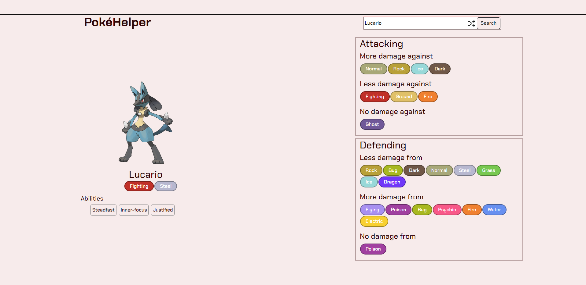

# Projeto2: Manipulando API pública  

  

### Deploy

[Link](https://elc1090.github.io/project2-lckrugel/)  

### Desenvolvedor

Leonardo Cargnin Krügel  

### Parceria  

Felipe Amadori  

### API

[PokeAPI](https://pokeapi.co/)  

### Tecnologias  

- React  
- React Bootstrap  

### Ambiente de desenvolvimento

- VS Code
- Navegador Mozilla Firefox / Google Chrome

### Créditos  

- [Botão "dentro" da caixa de pesquisa](https://stackoverflow.com/questions/15314407/how-to-add-button-inside-an-input)  
- [Cross Arrows - icon by icon king1 on freeicons.io](https://freeicons.io/profile/3)
- [Pokeball - icon by Darius Dan on flaticon.com](https://www.flaticon.com/free-icons/pokeball)
- [Pokémon type display stylesheet](https://github.com/justingolden21/pokemon-types-css)

### Bastidores  

Neste projeto pude aprender os conceitos básicos de estados no React e como utilizá-los.  

---
Projeto entregue para a disciplina de [Desenvolvimento de Software para a Web](http://github.com/andreainfufsm/elc1090-2023a) em 2023a  
